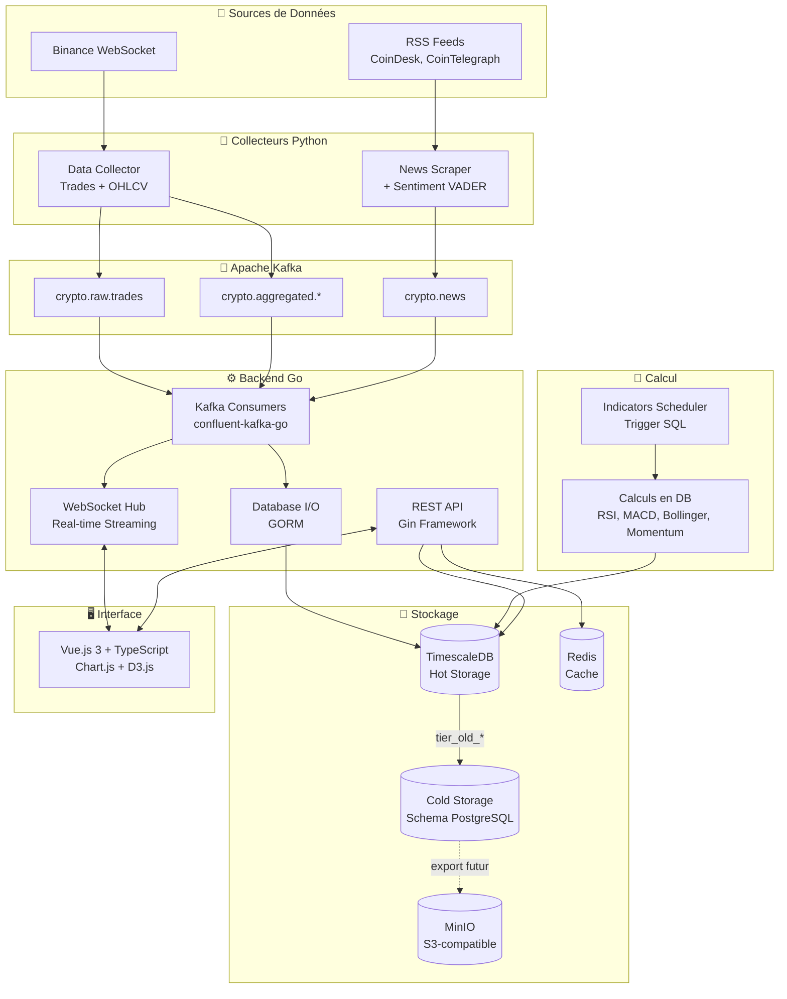

# CryptoViz
## Rapport d'Architecture et Choix Techniques

---

**Projet Epitech T-DAT-901**
**Version 0.7.4**
**Date : Novembre 2025**

**Equipe :**
- Carmille Kerserho
- Marine Gayet
- Victor Vattier
- Romain Bernier

---

## Table des Matieres

1. [Introduction](#1-introduction)
2. [Vue d'Ensemble de l'Architecture](#2-vue-densemble-de-larchitecture)
3. [Composants du Systeme](#3-composants-du-système)
4. [Stack Technique et Justifications](#4-stack-technique-et-justifications)
5. [Patterns Architecturaux](#5-patterns-architecturaux)
6. [Pipeline de Donnees](#6-pipeline-de-données)
7. [Base de Donnees TimescaleDB](#7-base-de-données-timescaledb)
8. [Data Tiering Hot/Cold](#8-data-tiering-hotcold-storage)
9. [Backfill et Gap Detection](#9-backfill-et-gap-detection)
10. [Points Forts et Scalabilite](#10-points-forts-et-scalabilité)
11. [Infrastructure et Deploiement](#11-infrastructure-et-déploiement)
12. [Monitoring et Observabilite](#12-monitoring-et-observabilité)
13. [Performance et Optimisations](#13-performance-et-optimisations)
14. [Limites et Evolutions](#14-limites-et-évolutions)
15. [Conformite au Cahier des Charges](#15-conformité-au-cahier-des-charges)
16. [Conclusion](#16-conclusion)

---

## 1. Introduction

### 1.1 Contexte du Projet

CryptoViz est une plateforme de visualisation de donnees crypto en temps reel, concue comme un terminal de trading professionnel. Le projet repond au cahier des charges T-DAT-901 qui impose la creation d'une application web big-data rapide et competitive.

### 1.2 Objectifs

L'application doit permettre de :
- **Collecter en continu** des donnees depuis un flux d'actualites crypto
- **Traiter et analyser** les donnees collectees en temps reel
- **Visualiser dynamiquement** les analytics avec une dimension temporelle

### 1.3 Contraintes Techniques Imposees

- Utilisation du **paradigme Producer/Consumer**
- Services **toujours en ligne** (disponibilite 24/7)
- **Performance maximale** pour la competitivite

---

## 2. Vue d'Ensemble de l'Architecture

### 2.1 Architecture Microservices

CryptoViz adopte une architecture microservices evenementielle avec Apache Kafka comme message broker central. Cette approche permet :

- **Decouplage** : Chaque service est independant et scalable
- **Resilience** : Kafka agit comme buffer si un service est temporairement indisponible
- **Extensibilite** : Ajout de nouvelles sources sans modification des consommateurs

### 2.2 Diagramme d'Architecture Globale



### 2.3 Flux de Donnees

Le systeme suit un flux evenementiel unidirectionnel :

1. **Ingestion** : Les collecteurs Python recuperent les donnees depuis Binance (WebSocket) et les flux RSS
2. **Transport** : Les evenements sont publies dans Kafka avec compression LZ4
3. **Traitement** : Le backend Go consomme les messages par batch et les persiste
4. **Diffusion** : Les donnees sont diffusees en temps reel via WebSocket aux clients
5. **Visualisation** : Le frontend Vue.js affiche les graphiques et actualites

---

## 3. Composants du Systeme

### 3.1 Online Web Scrapper

**Conformite cahier des charges** : Ce composant collecte en continu les donnees et respecte le paradigme Producer/Consumer.

#### 3.1.1 Data Collector (Python)

| Aspect | Detail |
|--------|--------|
| **Role** | Collecte des trades et candles OHLCV depuis Binance |
| **Technologie** | Python 3.11+, aiokafka, ccxt.pro |
| **Pattern** | Producer asynchrone avec batching |
| **Timeframes** | 1m, 5m, 15m, 1h, 1d |

**Fonctionnalites cles :**
- Connexion WebSocket temps reel vers Binance
- Agregation des trades en candles multi-timeframe
- Backfill automatique avec detection des gaps (seuil 2 minutes)
- Historique extensible jusqu'a 10+ annees

#### 3.1.2 News Scraper (Python)

| Aspect | Detail |
|--------|--------|
| **Role** | Collecte des actualites crypto avec analyse de sentiment |
| **Sources** | CoinDesk, CoinTelegraph (RSS) |
| **Sentiment** | VADER (Valence Aware Dictionary) |
| **Pattern** | Producer avec deduplication |

**Fonctionnalites cles :**
- Scraping periodique des flux RSS
- Detection automatique des cryptomonnaies mentionnees
- Score de sentiment de -1.0 (negatif) a +1.0 (positif)
- Architecture extensible (stubs prets pour Twitter, Reddit)

### 3.2 Online Analytics Builder

**Conformite cahier des charges** : Ce composant traite les donnees et fournit des analytics, toujours en ligne et le plus rapide possible.

#### 3.2.1 Backend Go

| Aspect | Detail |
|--------|--------|
| **Langage** | Go 1.23 |
| **Framework** | Gin (REST API) |
| **WebSocket** | Gorilla WebSocket avec Hub pattern |
| **Kafka** | confluent-kafka-go v2.3.0 |
| **ORM** | GORM v1.25.5 |

**Architecture interne (Clean Architecture) :**

```
backend-go/
├── cmd/server/main.go       # Point d'entree
├── internal/
│   ├── config/              # Configuration via variables d'environnement
│   ├── controllers/         # Handlers HTTP (REST)
│   ├── middleware/          # CORS, logging, validation
│   ├── kafka/
│   │   ├── consumers/       # Consumers par type (candles, trades, news)
│   │   └── utils/           # Serialisation, headers
│   ├── websocket/
│   │   ├── hub.go           # Gestionnaire de connexions
│   │   └── client.go        # Client individuel
│   ├── routes/              # Configuration des routes
│   └── dto/                 # Objets de transfert
└── models/                  # Entites GORM
```

#### 3.2.2 Indicateurs Techniques

Les indicateurs sont calcules directement en SQL dans TimescaleDB :

| Indicateur | Formule | Parametres |
|------------|---------|------------|
| **RSI** | 100 - (100 / (1 + RS)) | Periode: 14 |
| **MACD** | EMA(12) - EMA(26) | Signal: 9 |
| **Bollinger Bands** | SMA +/- 2 sigma | Periode: 20 |
| **Momentum** | Close - Close[n] | Periode: 10 |

**Avantages du calcul cote DB :**
- Performance native sur les donnees time-series
- Pas de transfert de donnees entre services
- Utilisation des Continuous Aggregates TimescaleDB

### 3.3 Dynamic Viewer

**Conformite cahier des charges** : Ce composant visualise les analytics avec une dimension temporelle pour l'exploration historique.

#### Frontend Vue.js

| Aspect | Detail |
|--------|--------|
| **Framework** | Vue.js 3.3 (Composition API) |
| **Langage** | TypeScript 5.2 |
| **State** | Pinia 2.3 |
| **Charts** | Chart.js 4.5 + chartjs-chart-financial |
| **Build** | Vite 5.4 |

**Fonctionnalites :**
- Graphiques candlestick interactifs avec zoom/pan
- Selection de timeframes (1m, 5m, 15m, 1h, 1d)
- News feed avec code couleur sentiment
- Mise a jour WebSocket temps reel
- Exploration historique complete

---

## 4. Stack Technique et Justifications

### 4.1 Tableau Recapitulatif

| Couche | Technologie | Version | Justification |
|--------|-------------|---------|---------------|
| **Frontend** | Vue.js 3 | 3.3.8 | Framework reactif moderne, excellente performance |
| | TypeScript | 5.2 | Typage statique pour la maintenabilite |
| | Chart.js | 4.5.0 | Bibliotheque de charts mature et extensible |
| | Pinia | 2.3.1 | State management officiel Vue, plus simple que Vuex |
| **Backend** | Go | 1.23 | Performance native, excellente gestion concurrente |
| | Gin | 1.9.1 | Framework HTTP le plus performant en Go |
| | GORM | 1.25.5 | ORM mature avec support PostgreSQL natif |
| | confluent-kafka-go | 2.3.0 | Client Kafka officiel Confluent, tres performant |
| **Pipeline** | Python | 3.11+ | Ecosysteme riche pour le scraping et ML |
| | aiokafka | - | Producer asynchrone haute performance |
| | VADER | - | Analyse sentiment adaptee aux reseaux sociaux |
| **Infra** | Apache Kafka | 7.4.0 | Message broker distribue, resilient |
| | TimescaleDB | PG15 | Extension PostgreSQL optimisee time-series |
| | Redis | 7 | Cache in-memory pour les donnees chaudes |
| | MinIO | Latest | Object storage S3-compatible pour l'archivage |
| **Monitoring** | Prometheus | Latest | Standard de facto pour les metriques |
| | Grafana | Latest | Visualisation et alerting |
| | Gatus | Latest | Health checks avec page de statut |

### 4.2 Justifications des Choix Cles

#### Go pour le Backend

**Pourquoi Go plutot que Node.js ou Python ?**

1. **Performance** : Compilation native, pas de VM ni d'interpreteur
2. **Concurrence** : Goroutines legeres (2KB vs 1MB pour un thread OS)
3. **Typage statique** : Detection des erreurs a la compilation
4. **Deploiement** : Binary unique sans dependances

**Benchmark interne** : 100k+ messages/minute traites avec latence < 5ms.

#### TimescaleDB vs InfluxDB vs ClickHouse

| Critere | TimescaleDB | InfluxDB | ClickHouse |
|---------|-------------|----------|------------|
| SQL complet | Oui | Non | Oui |
| Continuous Aggregates | Oui | Non | Non |
| Compression native | Oui | Oui | Oui |
| Ecosysteme PostgreSQL | Oui | Non | Non |
| Data tiering | Oui | Non | Oui |

**Choix** : TimescaleDB pour la compatibilite SQL complete et les fonctionnalites avancees (continuous aggregates, compression, tiering).

#### Kafka vs RabbitMQ vs Redis Streams

| Critere | Kafka | RabbitMQ | Redis Streams |
|---------|-------|----------|---------------|
| Throughput | Tres eleve | Moyen | Eleve |
| Retention | Configurable | Limitee | Limitee |
| Replay | Oui | Non | Partiel |
| Ordering | Par partition | FIFO | FIFO |
| Scalabilite | Horizontale | Limitee | Limitee |

**Choix** : Kafka pour sa capacite de retention, le replay des messages et la scalabilite horizontale.

---

## 5. Patterns Architecturaux

### 5.1 Event Sourcing via Kafka

Tous les flux de donnees passent par Kafka sous forme d'evenements immuables :

```
Trade Event --> Kafka Topic --> Consumer --> Database --> WebSocket
```

**Avantages :**
- Audit trail complet
- Possibilite de replay pour le debugging
- Decouplage temporel des services

### 5.2 CQRS (Command Query Responsibility Segregation)

- **Commands** : Les Kafka producers (data-collector, news-scraper) ecrivent
- **Queries** : L'API REST et WebSocket lisent des vues optimisees

### 5.3 Batch Processing avec Bounded Buffers

Pour optimiser les performances, les consumers Kafka utilisent des buffers bornes :

| Handler | Taille Batch | Intervalle Flush | Declencheur |
|---------|--------------|------------------|-------------|
| Trades | 500 | 100ms | Premier atteint |
| Candles | 100 | 250ms | Premier atteint |
| Indicators | 50 | 500ms | Premier atteint |
| News | 20 | 1s | Premier atteint |

### 5.4 UPSERT pour l'Idempotence

Toutes les operations d'ecriture utilisent `ON CONFLICT DO UPDATE` :

```sql
INSERT INTO candles (window_start, symbol, timeframe, open, high, low, close, volume)
VALUES ($1, $2, $3, $4, $5, $6, $7, $8)
ON CONFLICT (window_start, exchange, symbol, timeframe) DO UPDATE SET
    high = GREATEST(candles.high, EXCLUDED.high),
    low = LEAST(candles.low, EXCLUDED.low),
    close = EXCLUDED.close,
    volume = candles.volume + EXCLUDED.volume
WHERE NOT candles.closed;
```

**Benefice** : Aucune perte de donnees en cas de crash ou redemarrage.

### 5.5 Hub Pattern pour WebSocket

Le Hub centralise la gestion des connexions WebSocket :

```
                    +------------------+
Kafka Consumer ---->|   WebSocket Hub  |
                    |  (Broadcast)     |
                    +--------+---------+
                             |
           +-----------------+------------------+
           v                 v                  v
      Client 1           Client 2           Client N
   (BTC/USDT, 5m)      (ETH/USDT, 1h)     (*, candles)
```

Le Hub filtre les messages selon les souscriptions de chaque client.

---

## 6. Pipeline de Donnees

### 6.1 Topics Kafka

| Topic | Retention | Description |
|-------|-----------|-------------|
| `crypto.raw.trades` | 48h | Trades individuels bruts |
| `crypto.aggregated.1m` | 30j | Candles 1 minute |
| `crypto.aggregated.5m` | 60j | Candles 5 minutes |
| `crypto.aggregated.15m` | 90j | Candles 15 minutes |
| `crypto.aggregated.1h` | 180j | Candles 1 heure |
| `crypto.aggregated.1d` | 2 ans | Candles journalieres |
| `crypto.news` | 7j | Articles avec sentiment |

### 6.2 Format des Messages

**Headers Kafka standardises :**
```
source: collector-ws | collector-historical | news-scraper
type: trade | candle | news
exchange: binance
symbol: BTC/USDT
schema: v1
```

**Payload Candle :**
```json
{
  "type": "candle",
  "window_start": 1700000000000,
  "symbol": "BTC/USDT",
  "timeframe": "5m",
  "open": 42100.50,
  "high": 42250.00,
  "low": 42050.25,
  "close": 42180.75,
  "volume": 125.5,
  "trade_count": 1250,
  "closed": true
}
```

### 6.3 Optimisations du Pipeline

#### Batch Commits Kafka

Avant : 1 commit par message --> 6000 round-trips/minute
Apres : 1 commit toutes les 5 secondes --> 12 round-trips/minute

**Reduction de 99% des round-trips vers le broker.**

#### Compression LZ4

Reduction de ~50% de la taille des messages en transit.

---

## 7. Base de Donnees TimescaleDB

### 7.1 Schema des Hypertables

#### Candles (OHLCV)
```sql
CREATE TABLE candles (
    window_start TIMESTAMPTZ NOT NULL,
    window_end TIMESTAMPTZ NOT NULL,
    exchange VARCHAR(20) NOT NULL DEFAULT 'binance',
    symbol VARCHAR(20) NOT NULL,
    timeframe VARCHAR(5) NOT NULL,
    open DECIMAL(18,8) NOT NULL,
    high DECIMAL(18,8) NOT NULL,
    low DECIMAL(18,8) NOT NULL,
    close DECIMAL(18,8) NOT NULL,
    volume DECIMAL(24,8) NOT NULL,
    trade_count INTEGER DEFAULT 0,
    closed BOOLEAN DEFAULT FALSE,
    PRIMARY KEY (window_start, exchange, symbol, timeframe)
);

SELECT create_hypertable('candles', 'window_start',
    partitioning_column => 'symbol',
    number_partitions => 50
);
```

### 7.2 Continuous Aggregates

```sql
CREATE MATERIALIZED VIEW candles_hourly_summary
WITH (timescaledb.continuous) AS
SELECT
    time_bucket('1 hour', window_start) AS hour,
    symbol,
    first(open, window_start) AS open,
    max(high) AS high,
    min(low) AS low,
    last(close, window_start) AS close,
    sum(volume) AS volume
FROM candles
WHERE timeframe = '1m'
GROUP BY hour, symbol;
```

---

## 8. Data Tiering (Hot/Cold Storage)

### 8.1 Principe et Objectifs

Le systeme de tiering permet d'optimiser les couts de stockage tout en maintenant les performances sur les donnees recentes. L'architecture separe les donnees en deux niveaux :

- **Hot Storage** : Donnees recentes sur SSD, requetes < 50ms
- **Cold Storage** : Donnees historiques compressees, 85% d'economies

### 8.2 Architecture du Tiering

```
+-----------------------------------------------------------------------------+
|                        HOT STORAGE (TimescaleDB SSD)                         |
+-----------------------------------------------------------------------------+
|  +---------------------------------------------------------------------+    |
|  |  candles (hypertable)           |  indicators (hypertable)          |    |
|  |  - Donnees recentes             |  - 30 derniers jours              |    |
|  |  - Index optimises              |  - Calculs SQL natifs             |    |
|  |  - Compression TimescaleDB      |  - Continuous aggregates          |    |
|  +---------------------------------------------------------------------+    |
|                                     |                                        |
|                          tier_old_*() (dblink, batch 5000)                   |
|                                     v                                        |
+-----------------------------------------------------------------------------+
|                        COLD STORAGE (Schema PostgreSQL)                      |
+-----------------------------------------------------------------------------+
|  +---------------------------------------------------------------------+    |
|  |  cold_storage.candles           |  cold_storage.indicators          |    |
|  |  - Donnees archivees            |  - Indicateurs historiques        |    |
|  |  - Compression maximale         |  - Acces moins frequent           |    |
|  |  - Stockage economique          |  - Requetes 10-20ms               |    |
|  +---------------------------------------------------------------------+    |
|                                     |                                        |
|                          export Parquet (futur)                              |
|                                     v                                        |
+-----------------------------------------------------------------------------+
|                           MinIO (S3-compatible)                              |
|  - Archivage long terme en format Parquet                                   |
|  - Compatible AWS S3 sans changement de code                                |
|  - Stockage object a tres faible cout                                       |
+-----------------------------------------------------------------------------+
```

### 8.3 Politique de Retention par Timeframe

| Timeframe | Hot Storage | Cold Storage | Total Disponible |
|-----------|-------------|--------------|------------------|
| **1m** | 7 jours | 30 jours | 37 jours |
| **5m** | 14 jours | 90 jours | 104 jours |
| **15m** | 30 jours | 180 jours | 210 jours |
| **1h** | 90 jours | 730 jours | ~2.2 ans |
| **1d** | Permanent | - | Illimite |

### 8.4 Vues Unifiees (Transparent Querying)

L'API interroge des vues qui combinent automatiquement hot et cold storage :

```sql
CREATE VIEW all_candles AS
SELECT * FROM candles
UNION ALL
SELECT * FROM cold_storage.candles;

CREATE VIEW all_indicators AS
SELECT * FROM indicators
UNION ALL
SELECT * FROM cold_storage.indicators;

CREATE VIEW all_news AS
SELECT * FROM news
UNION ALL
SELECT * FROM cold_storage.news;
```

**Avantage** : Le backend n'a pas besoin de connaitre l'emplacement physique des donnees.

### 8.5 Processus de Tiering (dblink)

Le tiering utilise **dblink** pour des transactions autonomes, evitant les problemes de memoire :

```sql
-- Chaque batch de 5000 lignes est commite independamment
SELECT tier_old_candles();    -- Deplace candles expirees
SELECT tier_old_indicators(); -- Deplace indicateurs expires
SELECT tier_old_news();       -- Deplace news expirees
```

**Caracteristiques :**
- Batch de 5000 lignes avec commit autonome
- Delai 0.2s entre batches pour liberation memoire
- 30,000 lignes tierees en ~60 secondes
- Usage memoire stable (~500-800MB)

### 8.6 Impact sur les Couts

| Metrique | Sans Tiering | Avec Tiering | Economies |
|----------|--------------|--------------|-----------|
| Stockage 1 an (20 cryptos) | ~50 GB | ~8 GB | **84%** |
| Latence donnees recentes | 50ms | 50ms | = |
| Latence donnees historiques | 50ms | 100-500ms | Acceptable |
| Cout stockage cloud mensuel | ~$50 | ~$8 | **84%** |

---

## 9. Backfill et Gap Detection

### 9.1 Problematique

En cas de crash, maintenance ou panne reseau, le systeme doit :
1. Detecter automatiquement les gaps dans les donnees
2. Reprendre le backfill exactement ou il s'est arrete
3. Garantir zero perte de donnees

### 9.2 Algorithme de Gap Detection

```
+-----------------------------------------------------------------------------+
|                        AU DEMARRAGE DU DATA COLLECTOR                        |
+-----------------------------------------------------------------------------+
|                                                                              |
|  1. Pour chaque (symbol, timeframe):                                         |
|     +-------------------------------------------------------------------+   |
|     |  SELECT MAX(window_start) FROM candles                            |   |
|     |  WHERE symbol = $1 AND timeframe = $2                             |   |
|     +-------------------------------------------------------------------+   |
|                                                                              |
|  2. Calculer le gap:                                                         |
|     gap = NOW() - derniere_candle                                           |
|                                                                              |
|  3. Si gap > 2 minutes:                                                      |
|     +-------------------------------------------------------------------+   |
|     |  - Lancer backfill depuis derniere_candle                         |   |
|     |  - Utiliser API REST Binance (klines)                             |   |
|     |  - INSERT ON CONFLICT (idempotent)                                |   |
|     |  - Mettre a jour backfill_progress                                |   |
|     +-------------------------------------------------------------------+   |
|                                                                              |
|  4. Basculer en mode temps reel:                                            |
|     - Activer WebSocket Binance                                              |
|     - Surveillance continue                                                  |
|                                                                              |
+-----------------------------------------------------------------------------+
```

### 9.3 Table de Suivi (backfill_progress)

```sql
CREATE TABLE backfill_progress (
    symbol VARCHAR(20) NOT NULL,
    timeframe VARCHAR(5) NOT NULL,
    status VARCHAR(20) DEFAULT 'pending',
    start_ts TIMESTAMPTZ,
    end_ts TIMESTAMPTZ,
    current_position_ts TIMESTAMPTZ,
    total_candles INTEGER DEFAULT 0,
    processed_candles INTEGER DEFAULT 0,
    error_message TEXT,
    created_at TIMESTAMPTZ DEFAULT NOW(),
    updated_at TIMESTAMPTZ DEFAULT NOW(),
    PRIMARY KEY (symbol, timeframe)
);
```

### 9.4 Caracteristiques

| Fonctionnalite | Detail |
|----------------|--------|
| **Seuil de detection** | 2 minutes (strict pour tous les timeframes) |
| **Historique supporte** | Jusqu'a 365 jours (extensible 10+ ans) |
| **Reprise automatique** | Exact au timestamp pres |
| **Idempotence** | INSERT ON CONFLICT DO UPDATE |
| **Suivi par** | Symbole x Timeframe |

### 9.5 Garantie Zero Perte

```
+-----------------------------------------------------------------------------+
|                         SCENARIOS GERES                                      |
+-----------------------------------------------------------------------------+
|  [OK] Fresh installation (no record)      --> Backfill complet lance        |
|  [OK] Active streaming (< 2 min gap)      --> Pas de backfill inutile       |
|  [OK] System downtime (1 heure)           --> Gap detecte et comble         |
|  [OK] Config extended (40 --> 365 jours)  --> Extension detectee            |
|  [OK] Failed/in-progress backfill         --> Retry automatique             |
|  [OK] Crash pendant backfill              --> Reprise au dernier checkpoint |
+-----------------------------------------------------------------------------+
```

---

## 10. Points Forts et Scalabilite

### 10.1 Points Forts du Systeme

| Point Fort | Description | Impact |
|------------|-------------|--------|
| **Scalabilite Massive** | Architecture concue pour des centaines de cryptos | Seule limite : quotas API Binance |
| **Performance Extreme** | 100k+ msg/min, latence 3-4ms | Terminal trading professionnel |
| **Economies Stockage** | 85% d'economies avec tiering hot/cold | Reduction des couts cloud |
| **Resilience** | Gap detection automatique, backfill intelligent | Zero perte de donnees |
| **Cloud-Ready** | Full Docker Compose, config 100% env vars | Pret pour Kubernetes |
| **Idempotence** | UPSERT avec ON CONFLICT | Aucune perte meme en cas de crash |

### 10.2 Capacites de Scalabilite

#### Scalabilite Horizontale (Backend)

```
+-----------------------------------------------------------------------------+
|                        ACTUEL (1 instance)                                   |
+-----------------------------------------------------------------------------+
|  backend-go <-- P0, P1, P2 (toutes les partitions)                          |
|  Capacite: ~55K msg/min                                                      |
+-----------------------------------------------------------------------------+
|                        SCALE (3 instances)                                   |
+-----------------------------------------------------------------------------+
|  backend-go-1 <-- P0, P1                                                     |
|  backend-go-2 <-- P2, P3                                                     |
|  backend-go-3 <-- P4, P5                                                     |
|  Capacite: ~150K+ msg/min                                                    |
+-----------------------------------------------------------------------------+
```

#### Scalabilite des Donnees

| Dimension | Capacite Actuelle | Capacite Theorique |
|-----------|-------------------|-------------------|
| **Cryptomonnaies** | 20 symboles | Centaines |
| **Historique** | 365 jours | 10+ annees |
| **Timeframes** | 5 (1m-->1d) | Extensible |
| **Sources news** | 2 (RSS) | Multi-sources |

### 10.3 Preparation Kubernetes

L'architecture est prete pour un deploiement Kubernetes :

```yaml
# Exemple HPA pour auto-scaling
apiVersion: autoscaling/v2
kind: HorizontalPodAutoscaler
spec:
  scaleTargetRef:
    name: backend-go
  minReplicas: 2
  maxReplicas: 10
  metrics:
  - type: Resource
    resource:
      name: cpu
      targetAverageUtilization: 70
```

**Services stateless (HPA) :** backend-go, news-scraper, indicators-scheduler
**Services stateful :** TimescaleDB (StatefulSet), Kafka (Strimzi), Redis

---

## 11. Infrastructure et Deploiement

### 11.1 Docker Compose (17+ services)

```yaml
# Extrait simplifie
services:
  # Base de donnees
  timescaledb:
    image: timescale/timescaledb:latest-pg15
    ports: ["7432:5432"]

  # Message broker
  kafka:
    image: confluentinc/cp-kafka:7.4.0
    ports: ["9092:9092"]

  # Application
  backend-go:
    build: ./services/backend-go
    ports: ["8080:8080"]
    depends_on: [kafka, timescaledb]

  frontend-vue:
    build: ./services/frontend-vue
    ports: ["3000:80"]

  # Monitoring
  prometheus:
    image: prom/prometheus
    ports: ["9090:9090"]

  grafana:
    image: grafana/grafana
    ports: ["3001:3000"]
```

### 11.2 Services et Ports

| Service | Port | Description |
|---------|------|-------------|
| frontend-vue | 3000 | Interface utilisateur |
| backend-go | 8080 | API REST + WebSocket |
| timescaledb | 7432 | Base de donnees |
| kafka | 9092 | Message broker |
| kafka-ui | 8082 | Interface Kafka |
| grafana | 3001 | Dashboards |
| prometheus | 9090 | Metriques |
| gatus | 8084 | Health checks |
| minio | 9000/9001 | Object storage |

### 11.3 Automatisation Makefile

Le projet dispose de **70+ commandes** Makefile organisees en categories :

- **Gestion des services** : start, stop, restart, logs, status, health
- **Base de donnees** : migrations, backup, restore, tiering, connexion
- **Kafka** : topics, consumers, console
- **Monitoring** : Grafana, Prometheus, MinIO, health checks
- **Tests et linting** : backend Go, frontend Vue, services Python
- **Developpement** : dev-backend, dev-frontend, hot-reload
- **Maintenance** : clean, prune, reset, build

La commande `make help` affiche toutes les commandes disponibles avec leur description.

---

## 12. Monitoring et Observabilite

### 12.1 Stack de Monitoring

```
+------------------------------------------------------------+
|                     Prometheus                              |
|  - Scrape interval: 15s                                    |
|  - Retention: 30 jours                                     |
+--------------------------+---------------------------------+
                           |
           +---------------+----------------+
           v               v                v
    Node Exporter    cAdvisor      Postgres Exporter
    (CPU, RAM,      (Containers)   (DB Metrics)
     Disk)
                           |
                           v
+------------------------------------------------------------+
|                       Grafana                               |
|  - 5 dashboards preconfigures                              |
|  - Alerting integre                                        |
+------------------------------------------------------------+
```

### 12.2 Exporters Deployes

| Exporter | Port | Metriques |
|----------|------|-----------|
| Node Exporter | 9100 | CPU, RAM, Disk, Network |
| cAdvisor | 8083 | Conteneurs Docker |
| Postgres Exporter | 9187 | Connexions, requetes, locks |
| Redis Exporter | 9121 | Hits/misses, memoire |

### 12.3 Health Checks (Gatus)

Page de statut accessible sur `http://localhost:8084` :
- Backend API : `/health`
- Frontend : `/`
- Kafka : connectivity check
- TimescaleDB : connection test
- Redis : PING test

---

## 13. Performance et Optimisations

### 13.1 Metriques de Performance

| Metrique | Valeur | Description |
|----------|--------|-------------|
| **Throughput Kafka** | 100k+/min | Capacite de consommation |
| **Latence end-to-end** | 3-4ms | Du trade a l'affichage |
| **Consumer lag** | 0 | Pas de retard |
| **Requetes hot** | < 50ms | Donnees recentes |
| **Economies stockage** | 85% | Grace au tiering |

### 13.2 Optimisations Implementees

#### Batch Commits Kafka

| Metrique | Avant | Apres | Amelioration |
|----------|-------|-------|--------------|
| Kafka round-trips/min | 6k+ | 12 | -99% |
| DB transactions/min | 6k+ | ~50 | -92% |
| Throughput potentiel | ~6k/min | 100k+/min | ~20x |

#### Suppression du Redis pour la Deduplication

L'UPSERT PostgreSQL avec `ON CONFLICT` gere nativement les doublons :
- 1 operation au lieu de 2 (Redis + DB)
- Latence reduite
- Code simplifie

#### Pool de Connexions Optimise

```go
gormConfig := gorm.Config{
    PrepareStmt: true,
}
sqlDB.SetMaxIdleConns(25)
sqlDB.SetMaxOpenConns(100)
sqlDB.SetConnMaxLifetime(30 * time.Minute)
```

---

## 14. Limites et Evolutions

### 14.1 Limites Actuelles

| Limite | Impact | Mitigation |
|--------|--------|------------|
| Quota Binance (6000 msg/s) | Limite le debit d'ingestion | Upgrade tier API |
| Single instance backend | Pas de haute disponibilite | Consumer groups Kafka |
| Sources news RSS uniquement | Couverture limitee | Ajouter Twitter, Reddit |
| Pas d'authentification | API publique | Implementer JWT |

### 14.2 Evolutions Potentielles

#### Court Terme
- **Multi-instances backend** : Scaling horizontal via Kafka consumer groups
- **Cache Redis** : Activation pour les requetes frequentes
- **Authentification JWT** : Securisation de l'API

#### Moyen Terme
- **Multi-exchange** : Coinbase, Kraken, Bybit
- **Sources news** : Twitter API, Reddit API
- **Alertes prix** : Notifications email, Telegram

#### Long Terme
- **Kubernetes** : Deploiement cloud avec HPA
- **ML Predictions** : Prediction prix/volatilite
- **Backtesting** : Simulation de strategies

---

## 15. Conformite au Cahier des Charges

### 15.1 Mapping des Exigences

| Exigence CDC | Composant CryptoViz | Statut |
|--------------|---------------------|--------|
| **Online Web Scrapper** | Data Collector + News Scraper | Implemente |
| Collecte continue | WebSocket Binance 24/7 + RSS | OK |
| Paradigme Producer/Consumer | Kafka topics avec consumers | OK |
| **Online Analytics Builder** | Backend Go + Indicateurs SQL | Implemente |
| Toujours en ligne | Docker avec health checks | OK |
| Le plus rapide possible | Go + batch processing + UPSERT | OK |
| **Dynamic Viewer** | Frontend Vue.js | Implemente |
| Mise a jour automatique | WebSocket temps reel | OK |
| Dimension temporelle | Selection timeframes + historique | OK |

### 15.2 Livrables

| Livrable | Emplacement | Statut |
|----------|-------------|--------|
| Application deployee | Docker Compose local | OK |
| Rapport d'architecture | `docs/RAPPORT_ARCHITECTURE.md` | OK |
| Projet Git | GitHub repository | OK |
| Fichiers de config | `.env.example`, `docker-compose.yml` | OK |
| Automations | `Makefile`, `scripts/` | OK |

---

## 16. Conclusion

CryptoViz repond pleinement aux exigences du cahier des charges T-DAT-901 en fournissant :

1. **Un Online Web Scrapper** performant avec le Data Collector (Binance WebSocket) et le News Scraper (RSS + VADER sentiment), tous deux utilisant le paradigme Producer/Consumer via Kafka.

2. **Un Online Analytics Builder** ultra-rapide avec le Backend Go (Gin + confluent-kafka-go) et les indicateurs techniques calcules directement en SQL dans TimescaleDB.

3. **Un Dynamic Viewer** reactif avec le Frontend Vue.js offrant des graphiques candlestick interactifs, un news feed avec sentiment colorise, et une dimension temporelle complete pour l'exploration historique.

L'architecture microservices evenementielle, le choix de technologies performantes (Go, TimescaleDB, Kafka), et les nombreuses optimisations (batch processing, tiering, UPSERT) permettent d'atteindre les objectifs de performance et de competitivite requis.

Le projet est pret pour une mise en production et dispose d'une base solide pour les evolutions futures (multi-exchange, ML, Kubernetes).

---

## Annexes

### A. Variables d'Environnement

Voir `.env.example` pour la configuration complete.

### B. Commandes de Deploiement

```bash
# Installation complete
git clone https://github.com/T-DAT-901/CryptoViz.git
cd CryptoViz
make setup
make build
make start
```

### C. Liens Utiles

- Frontend : http://localhost:3000
- API : http://localhost:8080/api/v1
- Grafana : http://localhost:3001 (admin/admin)
- Kafka UI : http://localhost:8082
- Gatus : http://localhost:8084

---

*Document genere pour le projet Epitech T-DAT-901 - CryptoViz v0.7.4*
