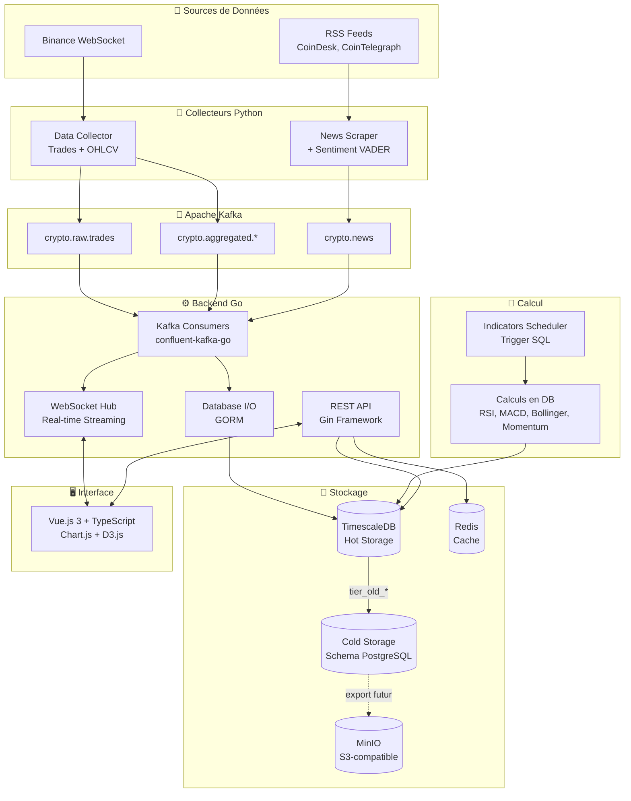
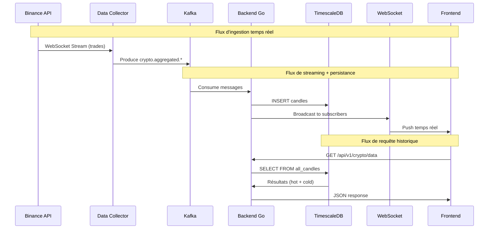
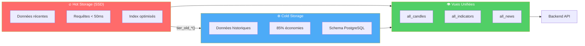

# CryptoViz - Terminal de Trading Crypto en Temps Réel


---

## Table des Matières

- [Présentation](#présentation)
- [Captures d'écran](#captures-décran)
- [Architecture](#architecture)
- [Points Forts](#points-forts)
- [Stack Technique](#stack-technique)
- [Prérequis](#prérequis)
- [Installation Rapide](#installation-rapide)
- [Structure du Projet](#structure-du-projet)
- [Services et Ports](#services-et-ports)
- [Pipeline de Données](#pipeline-de-données)
- [Optimisations de Performance](#optimisations-de-performance)
- [Data Tiering (Hot/Cold Storage)](#data-tiering-hotcold-storage)
- [Indicateurs Techniques](#indicateurs-techniques)
- [Analyse de Sentiment](#analyse-de-sentiment)
- [API REST](#api-rest)
- [WebSocket Streaming](#websocket-streaming)
- [Commandes Makefile](#commandes-makefile)
- [Monitoring](#monitoring)
- [Configuration](#configuration)
- [Documentation](#documentation)
- [Équipe et Licence](#équipe-et-licence)

---

## Présentation

**CryptoViz** est une plateforme de visualisation de données crypto en temps réel, conçue comme un terminal de trading professionnel. L'architecture microservices permet une scalabilité massive et une maintenance optimale.

Le système ingère des données depuis l'API Binance via WebSocket, les stocke dans TimescaleDB avec un système de tiering intelligent (hot/cold storage), et les expose via une API REST et WebSocket pour une interface Vue.js interactive.

### Fonctionnalités Clés

- **Streaming temps réel** : Throughput optimisé avec batch commits (30k+/min théorique)
- **Historique complet** : Backfill automatique jusqu'à 365 jours (extensible à 10+ ans)
- **Indicateurs techniques** : RSI, MACD, Bollinger Bands, Momentum
- **Analyse de sentiment** : Score VADER sur les actualités crypto
- **Data tiering** : 85% d'économies de stockage avec hot/cold storage
- **Cloud-ready** : Architecture prête pour Kubernetes

---

## Captures d'écran

### Interface Principale
<!-- SCREENSHOT: crypto-overview -->
*Vue d'ensemble des cryptomonnaies avec prix en temps réel*

### Charts de Trading
<!-- SCREENSHOT: trading-chart -->
*Graphiques candlestick interactifs avec sélection d'intervalles*

### News Feed
<!-- SCREENSHOT: news-sentiment -->
*Actualités crypto avec score de sentiment (-1 à +1)*

### Indicateurs Techniques
<!-- SCREENSHOT: indicators-panel -->
*Panneau RSI, MACD, Momentum et Bollinger Bands*

### Monitoring - Grafana
<!-- SCREENSHOT: grafana -->
*Dashboard de métriques système et applicatives*

### Monitoring - Kafka UI
<!-- SCREENSHOT: kafka-ui -->
*Visualisation des topics et messages Kafka*

### Health Checks - Gatus
<!-- SCREENSHOT: gatus -->
*Page de statut des services*

### Object Storage - MinIO
<!-- SCREENSHOT: minio -->
*Console MinIO pour le cold storage S3*

---

## Architecture



### Flux de Données

- Le **Data Collector** publie vers Kafka (trades et candles agrégées)
- Le **News Scraper** publie vers Kafka (architecture scalable pour ajouter d'autres sources)
- Le **Backend Go** consomme Kafka, écrit en DB et streame vers les WebSockets
- Les **indicateurs** sont calculés côté base de données (SQL) sans passer par Kafka

Cette architecture permet :

- **Découplage** : Chaque service est indépendant et scalable
- **Résilience** : Kafka comme buffer si le backend est temporairement down
- **Performance** : Calculs SQL natifs, streaming WebSocket optimisé
- **Extensibilité** : Ajout de nouvelles sources de news sans modification du backend

> **Note** : Une refactorisation future séparera la partie REST API de la partie I/O DB dans le backend Go.

---

## Points Forts

### 🚀 Scalabilité Massive
- Architecture conçue pour **des centaines de cryptomonnaies**
- Historique supporté : **10+ années de données**
- Seule limitation : quotas API Binance (tier gratuit = 20 symboles)
- Hypertables partitionnées (50 chunks) pour requêtes optimisées

### ⚡ Performance
- **30k+ messages/minute** capacité théorique avec batch commits
- **Latence 3-4ms** du trade à l'affichage
- **0 consumer lag** grâce à confluent-kafka-go + batch commits
- **Requêtes hot < 50ms** sur données récentes

### 💰 Optimisation des Coûts
- **85% d'économies** de stockage avec tiering hot/cold
- Rétention adaptée par timeframe (1m: 37j total, 1h: 2+ ans)
- MinIO remplaçable par AWS S3 sans changement de code

### 🔄 Résilience
- **Gap detection** automatique (seuil 2 minutes)
- **Backfill intelligent** qui reprend exactement où il s'est arrêté
- **Aucune perte de données** après maintenance ou crash

### ☁️ Cloud-Ready
- Full Docker Compose (17+ services)
- Configuration 100% via variables d'environnement
- Prêt pour Kubernetes (manque juste Helm Charts)

---

## Stack Technique

| Couche | Technologie | Version | Description |
|--------|-------------|---------|-------------|
| **Frontend** | Vue.js 3 | 3.3.8 | Interface utilisateur réactive |
| | TypeScript | 5.2 | Typage statique |
| | Chart.js | 4.5.0 | Graphiques candlestick |
| | D3.js | 7.8.5 | Visualisations avancées |
| | Pinia | 2.3.1 | State management |
| **Backend** | Go | 1.23 | API REST haute performance |
| | Gin | 1.9.1 | Framework HTTP |
| | GORM | 1.25.5 | ORM PostgreSQL |
| | Gorilla WebSocket | 1.5.1 | Streaming temps réel |
| | confluent-kafka-go | 2.3.0 | Consumer Kafka |
| **Data Pipeline** | Python | 3.11+ | Collecte et traitement |
| | Binance SDK | - | API WebSocket |
| | VADER Sentiment | - | Analyse de sentiment |
| **Infrastructure** | Apache Kafka | 7.4.0 | Message broker |
| | TimescaleDB | PG15 | Base time-series |
| | Redis | 7 | Cache |
| | MinIO | Latest | Object storage S3 |
| **Monitoring** | Prometheus | Latest | Métriques |
| | Grafana | Latest | Dashboards |
| | Gatus | Latest | Health checks |

---

## Prérequis

- **Docker** 20.10+
- **Docker Compose** 2.0+
- **RAM** : 8GB minimum (16GB recommandé)
- **Disque** : 20GB minimum
- **Ports disponibles** : 3000, 8080, 7432, 9092, etc.

---

## Installation Rapide

```bash
# 1. Cloner le repository
git clone https://github.com/T-DAT-901/CryptoViz.git
cd CryptoViz

# 2. Configuration initiale
make setup
# Éditer .env si nécessaire (clés API Binance optionnelles pour données publiques)

# 3. Compiler
make build

# 4. Démarrer tous les services
make start

# 5. Vérifier l'état
make status
make health

# 6. Accéder à l'interface
# Frontend : http://localhost:3000
# API : http://localhost:8080
# Grafana : http://localhost:3001 (admin/admin)
```

### Commandes de Démarrage Alternatives

```bash
make start-infra       # Infrastructure seule (DB, Kafka, Redis)
make start-services    # Microservices Python
make start-app         # Backend Go + Frontend Vue
make start-monitoring  # Stack Prometheus/Grafana
```

---

## Structure du Projet

```
CryptoViz/
├── services/
│   ├── backend-go/           # API REST + WebSocket (Go 1.23)
│   │   ├── cmd/server/       # Point d'entrée
│   │   ├── internal/         # Code applicatif (Clean Architecture)
│   │   │   ├── controllers/  # Handlers HTTP
│   │   │   ├── kafka/        # Consumers Kafka
│   │   │   ├── middleware/   # CORS, logging
│   │   │   └── websocket/    # Hub + Clients
│   │   └── models/           # Entités GORM
│   │
│   ├── frontend-vue/         # Interface utilisateur (Vue.js 3)
│   │   ├── src/components/   # Composants réutilisables
│   │   ├── src/services/     # Clients API et WebSocket
│   │   ├── src/stores/       # State Pinia
│   │   └── src/views/        # Pages
│   │
│   ├── data-collector/       # Collecte Binance (Python)
│   │   ├── binance_client.py # WebSocket connection
│   │   ├── aggregator.py     # OHLCV aggregation
│   │   └── historical_collector.py  # Backfill
│   │
│   ├── news-scraper/         # Actualités + Sentiment (Python)
│   │   ├── sources/          # Adaptateurs (RSS, Twitter, Reddit...)
│   │   ├── core/             # Kafka producer, sentiment analysis
│   │   └── models/           # Article dataclass
│   │
│   └── indicators-scheduler/ # Déclencheur indicateurs (Python)
│       └── scheduler.py      # Trigger des calculs SQL en DB
│
├── database/
│   ├── init.sql              # Schéma initial + hypertables
│   ├── setup-tiering.sql     # Fonctions hot/cold storage
│   ├── setup-indicators.sql  # Continuous aggregates
│   └── 04-backfill-tracking.sql  # Gap detection
│
├── monitoring/
│   ├── prometheus/           # Configuration scraping
│   ├── grafana/              # Dashboards préconfigurés
│   │   └── dashboards/       # 5 dashboards JSON
│   └── gatus/                # Health checks
│
├── scripts/
│   ├── start.sh              # Démarrage orchestré
│   ├── stop.sh               # Arrêt propre
│   └── demo-tiering.sh       # Démo interactive tiering
│
├── docs/                     # Documentation technique
├── docker-compose.yml        # Orchestration 17+ services
├── docker-compose.mac.yml    # Override Mac/WSL2
├── Makefile                  # 80+ commandes
└── .env.example              # Template configuration
```

---

## Services et Ports

| Service | Port | Description |
|---------|------|-------------|
| **frontend-vue** | 3000 | Interface utilisateur Vue.js |
| **backend-go** | 8080 | API REST + WebSocket |
| **timescaledb** | 7432 | Base de données TimescaleDB |
| **kafka** | 9092 | Message broker |
| **kafka-ui** | 8082 | Interface de gestion Kafka |
| **redis** | 7379 | Cache |
| **minio** | 9000/9001 | API S3 / Console Web |
| **grafana** | 3001 | Dashboards monitoring |
| **prometheus** | 9090 | Collecte métriques |
| **gatus** | 8084 | Page de statut |

> **Note** : Les ports non-standards (7432 au lieu de 5432) évitent les conflits avec des installations locales.

---

## Pipeline de Données



### Topics Kafka

| Topic | Rétention | Description |
|-------|-----------|-------------|
| `crypto.raw.trades` | 48h | Trades individuels |
| `crypto.aggregated.1m` | 30j | Candles 1 minute |
| `crypto.aggregated.5m` | 60j | Candles 5 minutes |
| `crypto.aggregated.15m` | 90j | Candles 15 minutes |
| `crypto.aggregated.1h` | 180j | Candles 1 heure |
| `crypto.aggregated.1d` | 2 ans | Candles journalières |
| `crypto.news` | 7j | Articles avec sentiment |

---

## Optimisations de Performance

Le backend Go implémente plusieurs optimisations critiques pour maximiser le throughput de consommation Kafka.

### Batch Commits Kafka

**Problème initial** : Un commit Kafka après chaque message génère une latence de ~10-50ms par message, limitant le throughput à ~600 messages/minute.

**Solution** : Commits groupés toutes les 5 secondes via un ticker.

```
┌─────────────────────────────────────────────────────────────┐
│                    AVANT (per-message)                       │
├─────────────────────────────────────────────────────────────┤
│  Message 1 → Process → Commit (10ms)                        │
│  Message 2 → Process → Commit (10ms)                        │
│  Message 3 → Process → Commit (10ms)                        │
│  ...                                                         │
│  = 600 commits/minute = 600 round-trips broker              │
├─────────────────────────────────────────────────────────────┤
│                    APRÈS (batch commit)                      │
├─────────────────────────────────────────────────────────────┤
│  Message 1 → Process → (pending)                            │
│  Message 2 → Process → (pending)                            │
│  ...                                                         │
│  [5s ticker] → Commit ALL → (1 round-trip)                  │
│  = 12 commits/minute = 99% moins de round-trips             │
└─────────────────────────────────────────────────────────────┘
```

**Impact** : Réduction de 99% des round-trips vers le broker Kafka.

### Batch Database Writes

Chaque handler bufferise les messages et les écrit en batch selon deux critères :

| Handler | Taille Batch | Intervalle Flush | Déclencheur |
|---------|--------------|------------------|-------------|
| Trades | 500 | 100ms | Premier atteint |
| Candles | 100 | 250ms | Premier atteint |
| Indicators | 50 | 500ms | Premier atteint |
| News | 20 | 1s | Premier atteint |

**Avantages** :
- Réduction des transactions DB de 90%+
- Utilisation optimale du pool de connexions
- Latence prévisible (bounded par l'intervalle)

### Idempotence et Sécurité

Toutes les opérations restent **idempotentes** grâce aux clauses `ON CONFLICT` :

```sql
-- Trades : ignore les duplicates
ON CONFLICT (trade_id, exchange, symbol, event_ts) DO NOTHING

-- Candles : merge intelligent des candles ouvertes
ON CONFLICT (window_start, exchange, symbol, timeframe) DO UPDATE SET
    high = GREATEST(candles.high, EXCLUDED.high),
    low = LEAST(candles.low, EXCLUDED.low),
    close = EXCLUDED.close,
    volume = candles.volume + EXCLUDED.volume
WHERE NOT candles.closed

-- Indicators : écrase avec les valeurs recalculées
ON CONFLICT (time, symbol, timeframe, indicator_type) DO UPDATE SET
    value = EXCLUDED.value
```

**Résultat** : Aucune perte de données en cas de crash, redémarrage ou retraitement.

### Impact Global

| Métrique | Avant | Après | Amélioration |
|----------|-------|-------|--------------|
| Kafka round-trips/min | 600+ | 12 | **-99%** |
| DB transactions/min | 600+ | ~50 | **-92%** |
| Throughput potentiel | ~630/min | 30k+/min | **~50x** |
| Latence max (commit) | Variable | 5s | Prévisible |

> **Note** : Le throughput réel dépend du volume de données entrantes depuis Binance, pas de la capacité du backend.

---

## Data Tiering (Hot/Cold Storage)

CryptoViz implémente un système de **tiering adaptatif** qui optimise les coûts de stockage tout en maintenant les performances.



### Rétention par Timeframe

| Timeframe | Hot Storage | Cold Storage | Total |
|-----------|-------------|--------------|-------|
| **1m** | 7 jours | 30 jours | 37 jours |
| **5m** | 14 jours | 90 jours | 104 jours |
| **15m** | 30 jours | 180 jours | 210 jours |
| **1h** | 90 jours | 730 jours | ~2 ans |
| **1d** | Permanent | - | ∞ |

### Commandes Tiering

```bash
# Voir les statistiques hot/cold
make tiering-stats

# Déclencher le tiering manuellement
make tiering

# Vérifier la configuration
make db-verify-tiering
```

### Architecture Technique

Le tiering utilise **dblink** pour des transactions autonomes, évitant les problèmes de mémoire (OOM) lors du déplacement de grandes quantités de données :

```sql
-- Chaque batch de 5000 lignes est commité indépendamment
SELECT tier_old_candles();  -- Déplace les candles expirées
SELECT tier_old_indicators();  -- Déplace les indicateurs expirés
SELECT tier_old_news();  -- Déplace les news expirées
```

> **Documentation complète** : [docs/COLDSTORAGE.md](docs/COLDSTORAGE.md)

---

## Indicateurs Techniques

| Indicateur | Description | Paramètres | Formule |
|------------|-------------|------------|---------|
| **RSI** | Relative Strength Index | Période: 14 | RSI = 100 - (100 / (1 + RS)) |
| **MACD** | Moving Average Convergence Divergence | 12, 26, 9 | MACD = EMA(12) - EMA(26) |
| **Bollinger Bands** | Bandes de volatilité | Période: 20, Écart: 2σ | Upper/Lower = SMA ± 2×StdDev |
| **Momentum** | Indicateur de momentum | Période: 10 | MOM = Close - Close[n] |

### Calcul et Stockage

Les indicateurs sont **calculés directement en SQL** dans TimescaleDB pour des performances optimales. L'**Indicators Scheduler** (Python) déclenche périodiquement les fonctions SQL de calcul.

**Avantages du calcul côté DB** :
- Performance native sur les données time-series
- Pas de transfert de données entre services
- Utilisation des Continuous Aggregates TimescaleDB
- Pas de surcharge Kafka pour les indicateurs

```bash
# Voir les indicateurs calculés
make db-connect
SELECT * FROM indicators WHERE symbol = 'BTC/USDT' ORDER BY timestamp DESC LIMIT 10;
```

---

## Analyse de Sentiment

Le **News Scraper** intègre une analyse de sentiment via VADER (Valence Aware Dictionary and sEntiment Reasoner).

### Fonctionnalités

- **Sources actuelles** : CoinDesk, CoinTelegraph (RSS)
- **Architecture extensible** : Stubs prêts pour Twitter, Reddit et autres sources
- **Score** : -1 (très négatif) à +1 (très positif)
- **Détection** : Identification automatique des cryptos mentionnées (BTC, ETH, etc.)
- **Scalabilité Kafka** : Conçu pour gérer un grand volume de messages lors de l'ajout de nouvelles sources

### Exemple de Résultat

```json
{
  "title": "Bitcoin Surges Past $50,000",
  "sentiment_score": 0.85,
  "symbols": ["BTC", "BTCUSDT"],
  "source": "coindesk",
  "published_at": "2025-01-15T10:30:00Z"
}
```

---

## API REST

Base URL : `http://localhost:8080/api/v1`

| Méthode | Endpoint | Description |
|---------|----------|-------------|
| GET | `/health` | Health check |
| GET | `/crypto/data?symbol=BTC/USDT&interval=1m` | Données historiques OHLCV |
| GET | `/crypto/latest?symbol=BTC/USDT` | Dernier prix |
| GET | `/stats?symbol=BTC/USDT` | Statistiques 24h |
| GET | `/indicators/:type?symbol=BTC/USDT` | Indicateur spécifique (rsi, macd, bollinger, momentum) |
| GET | `/indicators?symbol=BTC/USDT` | Tous les indicateurs |
| GET | `/news` | Actualités récentes |
| GET | `/news/:symbol` | Actualités par crypto |

### Exemple de Requête

```bash
# Récupérer les candles 5m de BTC/USDT
curl "http://localhost:8080/api/v1/crypto/data?symbol=BTC/USDT&interval=5m&limit=100"

# Récupérer le RSI
curl "http://localhost:8080/api/v1/indicators/rsi?symbol=BTC/USDT"
```

> **Documentation complète** : [docs/api.md](docs/api.md)

---

## WebSocket Streaming

Endpoint : `ws://localhost:8080/ws/crypto`

### Messages Supportés

```json
// Souscrire aux trades BTC
{"action": "subscribe", "type": "trade", "symbol": "BTC/USDT"}

// Souscrire à toutes les candles 5m
{"action": "subscribe", "type": "candle", "symbol": "*", "timeframe": "5m"}

// Se désabonner
{"action": "unsubscribe", "type": "trade", "symbol": "BTC/USDT"}

// Lister les souscriptions
{"action": "list_subscriptions"}
```

### Formats de Réponse

```json
// Trade
{
  "type": "trade",
  "data": {
    "symbol": "BTC/USDT",
    "price": 42150.50,
    "quantity": 0.5,
    "timestamp": "2025-01-15T10:30:00Z"
  }
}

// Candle
{
  "type": "candle",
  "data": {
    "symbol": "BTC/USDT",
    "timeframe": "5m",
    "open": 42100,
    "high": 42200,
    "low": 42050,
    "close": 42150,
    "volume": 125.5
  }
}
```

---

## Commandes Makefile

### Gestion des Services

```bash
make start              # Démarrer tous les services
make stop               # Arrêter proprement
make stop-force         # Arrêt forcé
make restart            # Redémarrer tout
make restart-service SERVICE=backend-go  # Redémarrer un service
make status             # État des conteneurs
make health             # Vérifier la santé
make logs               # Logs en temps réel
make logs-service SERVICE=data-collector  # Logs d'un service
```

### Base de Données

```bash
make db-connect         # Shell psql
make db-backup          # Sauvegarde
make db-restore BACKUP=file.sql  # Restauration
make db-reset           # Reset complet (⚠️ perte de données)
make tiering            # Lancer le tiering hot→cold
make tiering-stats      # Distribution hot/cold
```

### Kafka

```bash
make kafka-topics       # Lister les topics
make kafka-console-consumer TOPIC=crypto.raw.trades  # Écouter un topic
make kafka-create-topic TOPIC=nouveau.topic  # Créer un topic
```

### Développement

```bash
make dev-backend        # Backend Go en mode dev
make dev-frontend       # Frontend Vue en mode dev
make build              # Construire toutes les images
make build-service SERVICE=backend-go  # Construire un service
make test               # Exécuter les tests
make lint               # Vérifier le code
make format             # Formater le code
```

### Monitoring

```bash
make monitor            # Afficher toutes les URLs
make grafana-console    # Info connexion Grafana
make prometheus-ui      # Info Prometheus
make minio-console      # Info MinIO
```

---

## Monitoring

### Stack Complète

| Outil | URL | Credentials | Description |
|-------|-----|-------------|-------------|
| **Grafana** | http://localhost:3001 | admin / admin | Dashboards |
| **Prometheus** | http://localhost:9090 | - | Métriques |
| **Kafka UI** | http://localhost:8082 | - | Topics Kafka |
| **Gatus** | http://localhost:8084 | - | Health checks |
| **MinIO** | http://localhost:9001 | minioadmin / minioadmin | Object storage |

### Dashboards Grafana Préconfigurés

1. **CryptoViz Overview** - Métriques applicatives
2. **PostgreSQL Database** - Métriques TimescaleDB
3. **Kafka Exporter** - Lag consumers, throughput
4. **Node Exporter** - Métriques système
5. **cAdvisor** - Métriques conteneurs

### Exporters Déployés

- **Node Exporter** (9100) - CPU, RAM, Disk
- **PostgreSQL Exporter** (9187) - Connexions, requêtes, locks
- **Redis Exporter** (9121) - Hits/misses, mémoire
- **Kafka Exporter** (9308) - Lag, messages/sec
- **cAdvisor** (8083) - Conteneurs Docker

---

## Configuration

### Variables d'Environnement Principales

Copier `.env.example` vers `.env` et adapter :

```bash
# API Binance (optionnel pour données publiques)
BINANCE_API_KEY=
BINANCE_SECRET_KEY=

# Base de données
TIMESCALE_HOST=timescaledb
TIMESCALE_PORT=5432
TIMESCALE_DB=cryptoviz
TIMESCALE_USER=postgres
TIMESCALE_PASSWORD=password

# Kafka
KAFKA_BROKERS=kafka:29092

# Data Collector
QUOTE_CURRENCIES=USDT,BUSD,FDUSD
MIN_VOLUME=5000000
MAX_SYMBOLS=20
ENABLE_BACKFILL=true
BACKFILL_LOOKBACK_DAYS=365
BACKFILL_TIMEFRAMES=1m,5m,15m,1h,1d

# Frontend (build-time)
VITE_API_URL=http://localhost:8080
VITE_WS_URL=ws://localhost:8080/ws/crypto
VITE_USE_MOCK=false
```

### Configuration Avancée

- **Rétention tiering** : Configurable par timeframe dans `.env`
- **Mémoire TimescaleDB** : Ajustable dans `docker-compose.yml` (6GB par défaut)
- **Partitions Kafka** : 3 par topic par défaut

---

## Documentation

| Document | Description |
|----------|-------------|
| [DEV.md](DEV.md) | Guide développeur, workflows, troubleshooting |
| [docs/api.md](docs/api.md) | Documentation API REST complète |
| [docs/COLDSTORAGE.md](docs/COLDSTORAGE.md) | Architecture Data Tiering |
| [docs/ARCHITECTURE.md](docs/ARCHITECTURE.md) | Architecture Backend Go |
| [docs/ports-configuration.md](docs/ports-configuration.md) | Configuration des ports |

---

## Équipe et Licence

### Projet Epitech T-DAT-901

CryptoViz a été développé dans le cadre du projet **T-DAT-901** à Epitech.

### Licence

MIT License - voir le fichier [LICENSE](LICENSE) pour plus de détails.

---

<p align="center">
  <b>CryptoViz</b> - Terminal de Trading Crypto en Temps Réel<br/>
  <sub>Epitech T-DAT-901 | 2025</sub>
</p>
